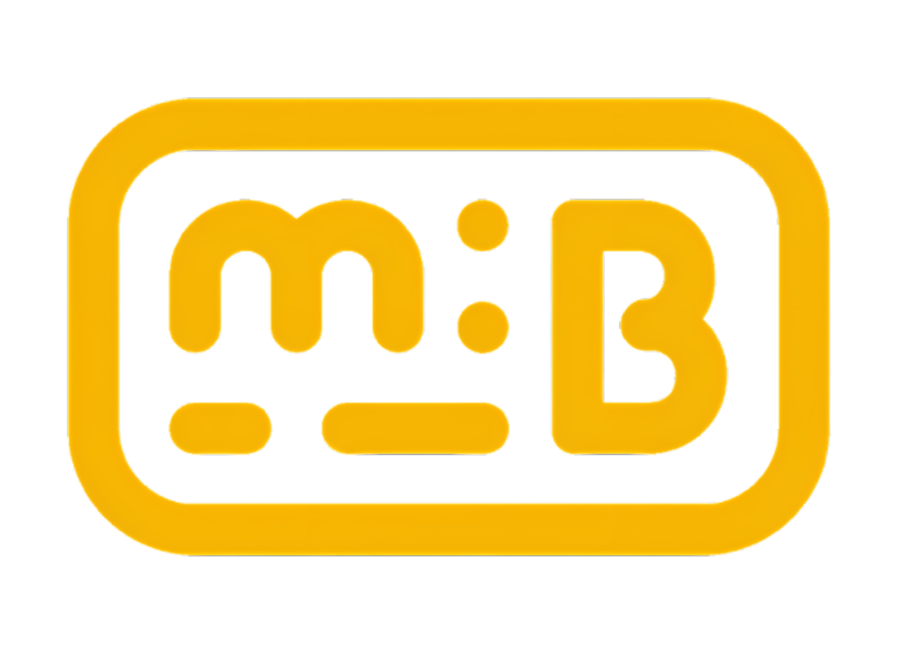
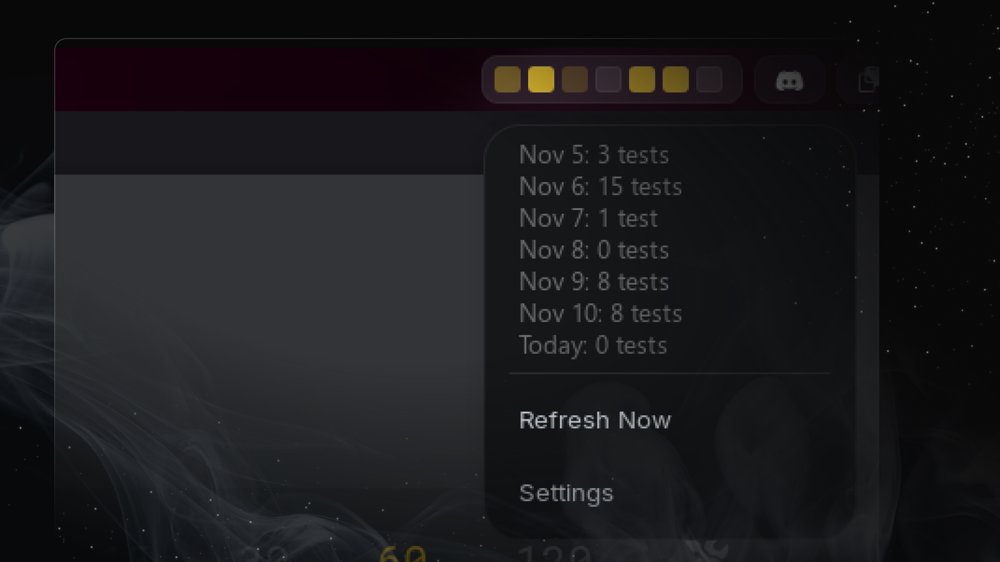

<div align="center">

  


# MonkeyBar

**A Beautiful GNOME Shell Extension for Monkeytype Enthusiasts**

*Track your typing activity with elegant visual feedback right in your top bar*

[](LICENSE)
[](https://extensions.gnome.org/extension/8831/monkeybar/)
[](https://github.com/AROICE-HQ/monkeybar)

[Features](#-features) • [Installation](#-installation) • [Configuration](#️-configuration) • [Themes](#-themes) • [Contributing](#-contributing)



</div>

---

## 📖 Overview

**MonkeyBar** transforms your [Monkeytype](https://monkeytype.com) typing activity into a beautiful visual calendar directly in your GNOME Shell top bar. Stay motivated, track your consistency, and celebrate your typing journey—all at a glance!

### Why MonkeyBar?

- 🎨 **Beautiful Visualizations**: 12 stunning color themes to match your desktop aesthetic
- 📊 **Activity Overview**: See 1-7 days of your typing activity in colorful boxes
- 🔄 **Auto-Sync**: Configurable refresh intervals keep your data current
- 🎯 **Zero Distraction**: Minimal, elegant interface that doesn't get in your way
- 🔒 **Privacy First**: Your data stays local; only Monkeytype API calls are made

---

## ✨ Features

### Core Functionality

| Feature | Description |
|---------|-------------|
| **📅 Customizable Activity Display** | Show 1-7 days of your typing activity in colorful boxes |
| **🖱️ Interactive Popup** | Left-click to see detailed daily test counts and dates |
| **🌐 Right-click Action** | Right-click to open Monkeytype homepage or your profile |
| **⚡ Real-time Updates** | Automatic data synchronization with Monkeytype |
| **🎨 12 Beautiful Themes** | From classic Monkeytype yellow to Dracula and Panda 🐼 |
| **📍 Flexible Positioning** | Place anywhere in your panel (left, center, or right) |
| **🌓 Dual Color Modes** | Opacity-based or grade-based visualization |
| **📆 Week Customization** | Start your week on any day (Monday, Sunday, etc.) |
| **💡 Current Day Highlight** | Optional border around today's box |

### Display Modes

#### **◆ Opacity Mode**
Activity intensity shown through transparency | more tests = more opaque

#### **◆ Grade Mode**
Distinct color levels based on test count thresholds

---

## 🚀 Installation

### Method 1: GNOME Extensions Website

1. Visit the [MonkeyBar extension page](https://extensions.gnome.org/extension/8831/monkeybar/)
2. Click the toggle to install
3. Configure your Monkeytype credentials

### Method 2: Manual Installation

```bash
# Clone the repository
git clone https://github.com/AROICE-HQ/monkeybar.git

# Create extensions directory if it doesn't exist
mkdir -p ~/.local/share/gnome-shell/extensions/

# Copy extension files
cp -r monkeybar ~/.local/share/gnome-shell/extensions/monkeybar@aroice.in

# Compile schemas
glib-compile-schemas ~/.local/share/gnome-shell/extensions/monkeybar@aroice.in/schemas/

# Restart GNOME Shell
# For X11: Press Alt+F2, type 'r', press Enter
# For Wayland: Log out and log back in

# Enable the extension
gnome-extensions enable monkeybar@aroice.in
```

### System Requirements

- **GNOME Shell**: 46, 47, or 48
- **Internet Connection**: Required for Monkeytype API access
- **Monkeytype Account**: Free account at [monkeytype.com](https://monkeytype.com)

---

## ⚙️ Configuration

### Quick Setup Guide

#### Step 1: Get Your Monkeytype Credentials

1. **Visit** [Monkeytype Settings](https://monkeytype.com/settings)
2. **Navigate** to the **ApeKeys** section
3. **Generate** a new ApeKey (don't forget to activate ape key)
4. **Copy** your username and the generated ApeKey

#### Step 2: Configure MonkeyBar

1. **Right-click** on the MonkeyBar widget in your top bar
2. **Select** "Settings"
3. **Enter** your credentials:
   - **Monkeytype Username**: Your account username
   - **ApeKey**: The key you just generated

#### Step 3: Customize Your Experience

Navigate through the settings page to personalize:

| Setting | Options | Default |
|---------|---------|---------|
| **Days to Show** | 1-7 days | 7 days |
| **Refresh Interval** | 15 min - 24 hours | 6 hours |
| **Panel Position** | Left, Center, Right | Right |
| **Color Theme** | 12 themes available | Monkeytype |
| **Color Mode** | Opacity or Grade | Opacity |
| **Week Start Day** | Any day of the week | Monday |
| **Highlight Today** | On/Off | Off |
| **Show Current Week** | On/Off | Off |
| **Right-click Action** | Open Homepage or Profile | Homepage |

### 🔐 Privacy & Security

- ✅ **Local Storage**: Your ApeKey is stored only on your computer
- ✅ **Direct API**: Communication only with Monkeytype's official API
- ✅ **No Third Parties**: Zero external servers or tracking
- ✅ **Read-Only**: Extension only reads your data, never modifies
- ✅ **Public Fallback**: Without ApeKey, shows public streak data only

---

## 🎨 Themes

MonkeyBar includes **12 beautiful themes** to match your desktop aesthetic:

### Classic Themes
- **🟡 Monkeytype** - Classic yellow theme (default)
- **🟢 GitHub Green** - GitHub green gradient style

### Popular Themes
- **🧛 Dracula** - Purple and pink accents on dark background
- **🎃 Halloween** - Spooky orange and black
- **🐼 Panda** - Black and white with colorful highlights
- **☀️ Sunny** - Bright yellow/gold gradient

### Color Variations
- **🔵 Blue** - Cool blue gradient
- **🩷 Pink** - Pink/magenta gradient
- **🐚 Teal** - Calming aqua colors

### Developer Favorites
- **🌅 Solarized Light** - Popular light developer theme
- **🌙 Solarized Dark** - Popular dark developer theme
- **⬜ @left_pad** - Minimalist grayscale theme

---

## 🛠️ Development

### Building from Source

```bash
# Clone the repository
git clone https://github.com/AROICE-HQ/monkeybar.git
cd monkeybar

# Compile schemas
glib-compile-schemas schemas/

# Install locally
mkdir -p ~/.local/share/gnome-shell/extensions/monkeybar@aroice.in
cp -r * ~/.local/share/gnome-shell/extensions/monkeybar@aroice.in/

# Enable the extension
gnome-extensions enable monkeybar@aroice.in
```

### Project Structure

```
monkeybar@aroice.in/
├── extension.js              # Main extension logic
├── prefs.js                  # Settings/preferences UI
├── metadata.json             # Extension metadata
├── helpers/
│   ├── monkeytypeService.js  # Monkeytype API integration
│   ├── settings.js           # Settings management
│   └── about.js              # About page
├── schemas/
│   └── org.gnome.shell.extensions.monkeybar.gschema.xml
└── icons/
    └── PNG/                  # Extension icons
```

### Debugging

```bash
# Watch GNOME Shell logs
journalctl -f -o cat /usr/bin/gnome-shell

# Or filter for MonkeyBar only
journalctl -f -o cat /usr/bin/gnome-shell | grep -i monkeybar

# Use GNOME Looking Glass (Alt+F2, type 'lg')
Main.extensionManager.lookup('monkeybar@aroice.in')
```

### API Information

MonkeyBar uses the official Monkeytype API:

**Endpoints:**
- `GET /users/{username}/profile` - Public profile and streak data
- `GET /users/currentTestActivity` - Authenticated daily test activity

---

## 🤝 Contributing

Contributions are welcome! Whether it's bug reports, feature requests, or code contributions, every bit helps.

### How to Contribute

1. **Fork** the repository
2. **Create** a feature branch:
   ```bash
   git checkout -b feature/amazing-feature
   ```
3. **Make** your changes
4. **Test** thoroughly on your system
5. **Commit** with clear messages:
   ```bash
   git commit -m 'Add: amazing feature description'
   ```
6. **Push** to your fork:
   ```bash
   git push origin feature/amazing-feature
   ```
7. **Open** a Pull Request

### Development Guidelines

- Follow existing code style and conventions
- Test on GNOME Shell 46, 47, and 48 if possible
- Update documentation for new features
- Keep commits atomic and well-described
- Respect the MIT license

### Feature Roadmap

- [x] ✅ Settings page with credential management
- [x] ✅ Automatic data fetching with intervals
- [x] ✅ Customizable panel positioning
- [x] ✅ Interactive popup with daily counts
- [x] ✅ Week start day configuration
- [x] ✅ Multiple color themes (12 themes)
- [x] ✅ Dual coloring modes (opacity/grade)
- [x] ✅ Current day highlighting
- [x] ✅ Configurable days to show (1-7 days)
- [x] ✅ Right-click to open Monkeytype (homepage or profile)
- [ ] 🔄 Customizable activity thresholds
- [ ] 🔄 Multiple account support
- [ ] 🔄 Monthly/yearly view options
- [ ] 🔄 Keyboard shortcuts
- [ ] 🔄 Achievement notifications

...

---

## 🐛 Troubleshooting

### Common Issues

<details>
<summary><b>Extension not showing typing activity?</b></summary>

**Solutions:**
- Verify your username is correct (case-sensitive)
- Ensure ApeKey has proper permissions
- Check internet connection
- Wait for next refresh or click "Refresh Now"
- Check logs: `journalctl -f | grep -i monkeybar`
</details>

<details>
<summary><b>Widget not appearing in top bar?</b></summary>

**Solutions:**
- Confirm extension is enabled in Extensions app
- Restart GNOME Shell (Alt+F2, type `r`, Enter on X11)
- Check GNOME Shell version compatibility (46, 47, 48)
- Verify installation path is correct
</details>

<details>
<summary><b>Shows only streak data, not daily activity?</b></summary>

**Solution:**
- This happens when no ApeKey is provided
- Generate an ApeKey at [Monkeytype Settings](https://monkeytype.com/settings)
- Add it in MonkeyBar settings
</details>

<details>
<summary><b>Colors not updating correctly?</b></summary>

**Solutions:**
- Try switching between opacity and grade modes
- Select a different theme and switch back
- Click "Refresh Now" in the dropdown menu
</details>

### Getting Help

- 🐛 **Bug Reports**: [Open an issue](https://github.com/AROICE-HQ/monkeybar/issues)
- 💬 **Questions**: Check existing issues or start a discussion
- 📧 **Contact**: aryan@aroice.in

---

## 👥 Credits

**MonkeyBar** is proudly developed and maintained by:

### Development Team

**[Aryan Techie (@Aryan-Techie)](https://github.com/aryan-techie)** - 
*Creator & Lead Developer*

- Full extension concept and implementation
- Monkeytype API integration (public and authenticated endpoints)
- UI/UX design and all functionality
- Complete theme system (12 themes with opacity and grade modes)
- Settings and preferences architecture
- Documentation and project structure
- Interactive features (left-click popup, right-click actions)

### Inspiration

- **[Weekly Commits](https://github.com/funinkina/weekly-commits)** by [@funinkina](https://github.com/funinkina) - Original inspiration for activity visualization
- **[Monkeytype](https://monkeytype.com)** - The amazing typing practice platform
- **GNOME Shell Extension Community** - For excellent documentation and support

---

## 💖 Support the Project

If you find MonkeyBar useful, consider supporting its development:

<div align="center">

[](https://github.com/sponsors/aryan-techie)

**Star the repository** ⭐ to help others discover MonkeyBar!

</div>

---

## 📄 License

This project is licensed under the **MIT License**.

```
MIT License

Copyright (c) 2025 Aryan Techie (AROICE)

Permission is hereby granted, free of charge, to any person obtaining a copy
of this software and associated documentation files (the "Software"), to deal
in the Software without restriction, including without limitation the rights
to use, copy, modify, merge, publish, distribute, sublicense, and/or sell
copies of the Software, and to permit persons to whom the Software is
furnished to do so, subject to the following conditions:

The above copyright notice and this permission notice shall be included in all
copies or substantial portions of the Software.

THE SOFTWARE IS PROVIDED "AS IS", WITHOUT WARRANTY OF ANY KIND, EXPRESS OR
IMPLIED, INCLUDING BUT NOT LIMITED TO THE WARRANTIES OF MERCHANTABILITY,
FITNESS FOR A PARTICULAR PURPOSE AND NONINFRINGEMENT. IN NO EVENT SHALL THE
AUTHORS OR COPYRIGHT HOLDERS BE LIABLE FOR ANY CLAIM, DAMAGES OR OTHER
LIABILITY, WHETHER IN AN ACTION OF CONTRACT, TORT OR OTHERWISE, ARISING FROM,
OUT OF OR IN CONNECTION WITH THE SOFTWARE OR THE USE OR OTHER DEALINGS IN THE
SOFTWARE.
```

See the [LICENSE](LICENSE) file for complete details.

---

## 🔗 Links

- **🏠 Repository**: [github.com/AROICE-HQ/monkeybar](https://github.com/AROICE-HQ/monkeybar)
- **🐛 Issues**: [Report a Bug](https://github.com/AROICE-HQ/monkeybar/issues)
- **👨‍💻 Developer**: [Aryan Techie](https://github.com/aryan-techie)
- **🏢 Brand**: [AROICE](https://aroice.in)
- **⌨️ Monkeytype**: [monkeytype.com](https://monkeytype.com)
- **📚 API Docs**: [api.monkeytype.com/docs](https://api.monkeytype.com/docs)

---

<div align="center">

### Made with ❤️ by AROICE for the GNOME & Monkeytype communities

[](https://www.gnome.org/)
[](https://monkeytype.com)
[](https://developer.mozilla.org/en-US/docs/Web/JavaScript)

---

#### Legal Notice

*This project is not affiliated with, endorsed by, or officially connected with Monkeytype or the GNOME Foundation. The use of the Monkeytype name and logo is for informational purposes only and does not imply any endorsement or affiliation. All trademarks and copyrights are the property of their respective owners.*

**MonkeyBar** is an independent, community-driven project created by passionate developers for the typing community.

---

**⭐ If you enjoy MonkeyBar, please star the repository!**

---

*Last Updated: November 11, 2025*

</div>

</div>
